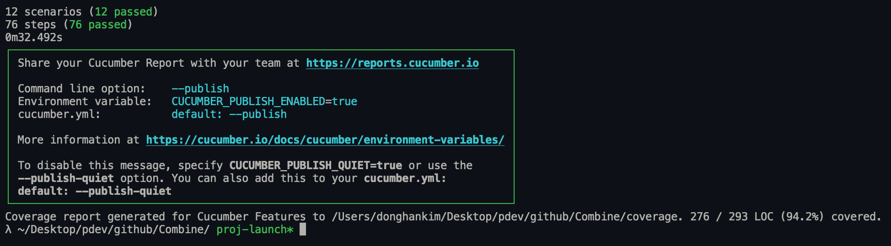
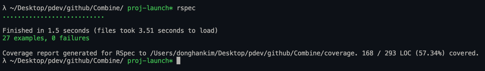

# [Group 29] Combine: <a href="https://group29-combine.herokuapp.com/" target="_blank">Heroku Application Link</a>

* Jade Kaleel jik2124
* Donghan Kim dk3245
* Elia Lejzerowicz eel2157

## Software Requirements
* Ruby Version: 2.6.6
* Rails Version: 6.1.7
* Node Version: v14.20.1
* Development DB: sqlite3 v1.4
* Production DB: postgres v1.4
* Heroku stack: 20

## Software Installations Guide
ALL packages were installed using homebrew. These steps will work on **M1/M2 macbooks**. However, for other mac variants some of these steps might not work at once.
```sh
# install rbenv and ruby-build
brew install rbenv ruby-build

# install ruby 2.6.6, and set to global version
RUBY_CFLAGS="-w" rbenv install 2.6.6
rbenv global 2.6.6

# rails 6.1.7 installation
gem install rails -v 6.1.7
rbenv rehash

# verify rails version with rails -v

# install sqlit3
brew install sqlite3

# install postrgesql
brew install postgresql
```
If this doesnt work, checkout <a href="https://gorails.com/setup/macos/12-monterey" target="_blank">ruby & rails install guide</a>

## Local Development
The following are instructions to run this application on your local machine
```sh
# cloning the repository
git clone https://github.com/donghankim/Combine.git
cd Combine

# install up gems
rm Gemfile.lock
bundle install

# set up local database (please do not run rake db:migrate, no migration files have been uploaded!)
rake db:drop
rake db:create
rake db:schema:load

# start server on localhost:3000
rails server

# to run cucumber tests
cd Combine
rm -r coverage
cucumber

# to run rspec
cd Combine
rm -r coverage
rspec
```
If you get an error from running bundle install, try using **sudo bundle install**. This is not recommended, but will solve any permission errors you encounter.

## Rspec and Cucumber
* <strong>Cucumber coverage: 94.7% (12 scenarios, 76 steps, 0 failures)</strong>
* <strong>Rspec coverage: 57.34% (27 example, 0 failures)</strong>

Please keep in mind you have to remove the coverage folder before running either cucumber or rspec for the most recent coverage report.



## Heroku
We have created fake users to help you evaluate and test our application. You can check the recommendation, searching/adding/removing friends feature using the test account.
* Email: test@gmail.com
* Password: test1234

When searching friends, we use Levenshtein distance with some added tolerance to ensure friends are searchable even in the presence of typos. For example, searching micheal@nyu.edi (typo) still returns micheal@nyu.edu (actual email).
