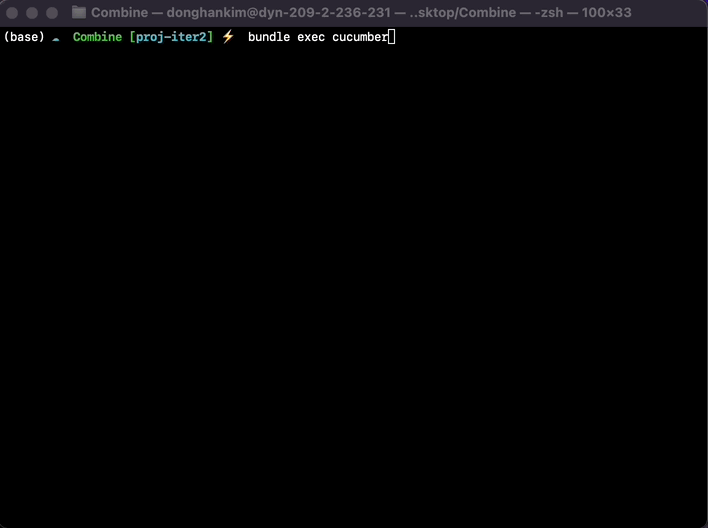
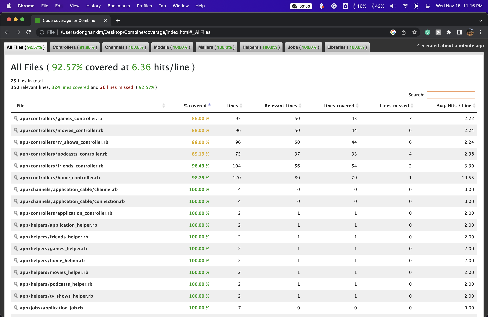
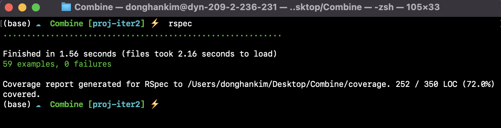
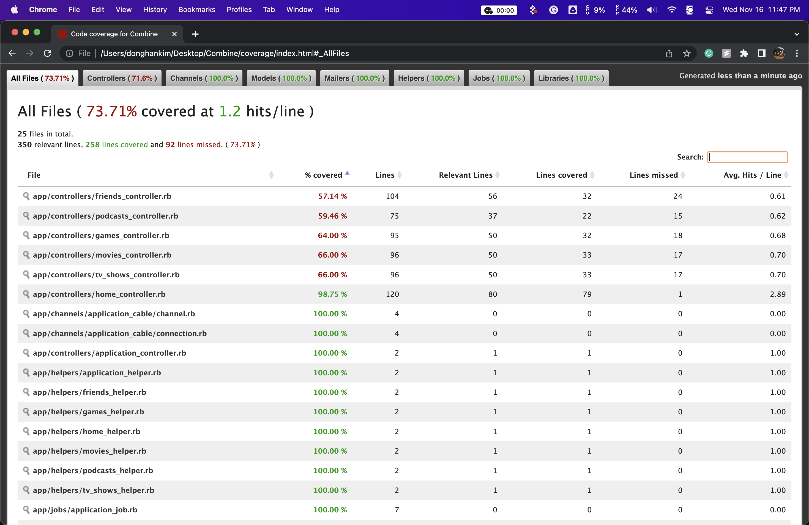

# [Group 29]: Combine! [Heroku Link](https://group29-combine.herokuapp.com/)

* Jade Kaleel jik2124
* Donghan Kim dk3245
* Elia Lejzerowicz eel2157

## Message From The Team
We would like to inform the TA's that one of our group member did not communicate his decision to leave our team. As a result, we were a little blindsided by the amount of work we had to do for this iteration...

For proj-iter1, we were deducted points for failing cucumber tests when the tests were working well on our local machines. For that reason we have uploaded image proof to showcase our cucumber and rspec test results. If your results don't match ours, please give ur a chance to explain.
Thank you for your assistance.

## Software Requirements
* Ruby Version: 2.6.6
* Rails Version: 6.1.7
* Node Version: v14.20.1
* Development DB: sqlite3 v1.4
* Production DB: postgres v1.4
* OS: Mac Monterey 12.5
* Heroku stack: 20

## Software Installations Guide
ALL packages were installed using homebrew. These steps will work on **M1/M2 macbooks**. However, for other mac variants some of these steps might not work at once.

```sh
# install rbenv and ruby-build
brew install rbenv ruby-build

# install ruby 2.6.6, and set to global version
RUBY_CFLAGS="-w" rbenv install 2.6.6
rbenv global 2.6.6

# rails 6.1.7 installation
gem install rails -v 6.1.7
rbenv rehash

# verify rails version with rails -v

# install sqlit3
brew install sqlite3

# install postrgesql
brew install postgresql
```

## Application Local Development
The following are instructions to run this application on your local machine
```sh
# cloning the repository
git clone https://github.com/donghankim/Combine.git
cd Combine
git checkout proj-iter1

# install up gems
rm Gemfile.lock
bundle install

# set up local database
rake db:migrate

# start server on localhost:3000
rails server

# to run cucumber tests
cd Combine
rm -r coverage
cucumber

# to run rspec
cd Combine
rm -r coverage
rspec
```
If you get an error from running bundle install, try using **sudo bundle install**. This is not recommended, but will solve any permission errors you encounter.

## Cucumber Test Results



**92% coverage**

## Rspec Test Results



**64% coverage**


